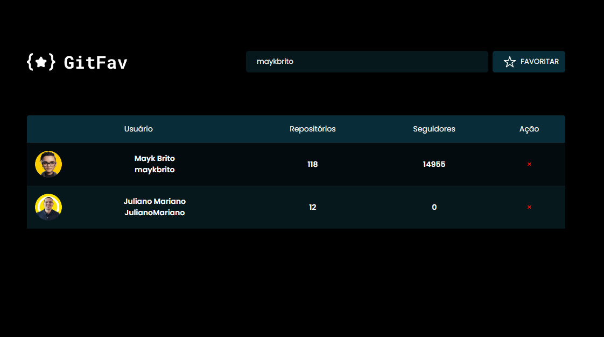

<h1 align="center"> GITFAV★ </h1>

O GITFAV★ foi uma aplicação proposta pela RocketSeat no programa de formação WEB EXPLORER e desenvolvida por mim, Juliano Mariano.  

  <a href="#-tecnologias">Tecnologias</a>&nbsp;&nbsp;&nbsp;|&nbsp;&nbsp;&nbsp;
  <a href="#-projeto">Projeto</a>&nbsp;&nbsp;&nbsp;|&nbsp;&nbsp;&nbsp;
  <a href="#-layout">Layout</a>&nbsp;&nbsp;&nbsp;|&nbsp;&nbsp;&nbsp;
  <a href="#-Contato">Contato</a>

 

  

## 🚀 Tecnologias

Esse projeto foi desenvolvido com as seguintes tecnologias:

- HTML e CSS;
- Javascript;
- Git e Github;
- json;
- Node Modules;
- Figma.

## 💻 Projeto
O GITFAV★ é uma aplicação que oferece uma visão rápida e abrangente de perfis do GitHub. Ao digitar o nome de usuário na barra de busca, a aplicação fornece instantaneamente a foto de perfil, número de seguidores e a lista de repositórios públicos daquele usuário, encurtando o caminho para seus user's favoritos. 
Em certo momento você pode se perguntar, "será que eu ja adicionei essa pessoa a minha lista de favoritos?" Temos a solução!!! Através das higher order functions, podemos retornar um evento "Usuário já cadastrado".  

<a href="https://julianomariano.github.io/GitHub-Favorites/" target="_blank">Visite o projeto online</a>

<!-- - [Visite o projeto online](https://julianomariano.github.io/GitHub-Favorites/) -->

## 🔖 Layout

Você pode visualizar o layout do projeto através [DESSE LINK](https://www.figma.com/file/WgcBhwUf39ZQgAeXFvLNtH/%5BDesafios-Explorer%5D-GitFav-(Copy)-(Copy)?node-id=0%3A1&mode=dev). É necessário ter conta no [Figma](https://figma.com) para acessá-lo.

## 🌐 Contato

LinkedIn: Juliano Mariano
 -  https://www.linkedin.com/in/juliano-marianodev/